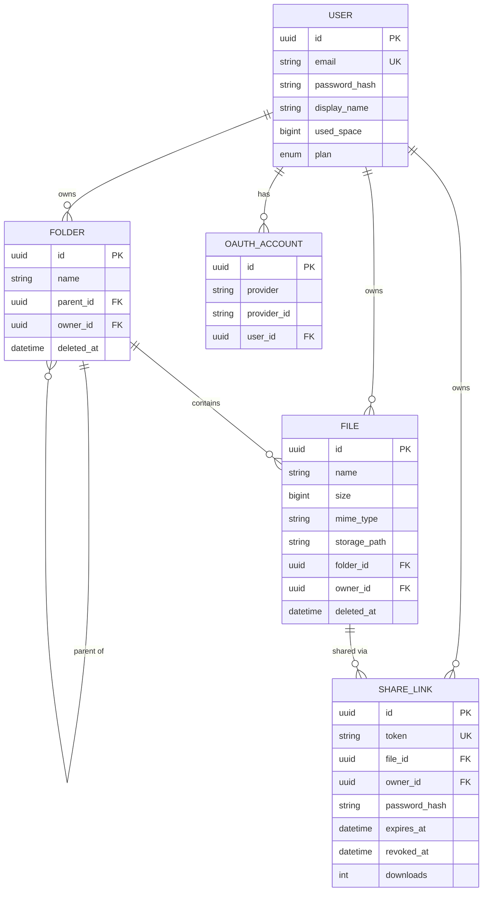

# Architecture

## Vue d'ensemble

```
┌─────────────────┐       ┌─────────────────┐
│   Web client    │       │ Mobile client   │
│ React + Vite    │       │ Expo / RN       │
│ nginx (port 80) │       │                 │
└────────┬────────┘       └────────┬────────┘
         │                         │
         │     HTTPS / JSON        │
         └──────────┬──────────────┘
                    │
                    ▼
         ┌──────────────────────┐
         │   API NestJS         │
         │   port 3000          │
         │ ┌──────────────────┐ │
         │ │ auth / files /   │ │
         │ │ folders / share/ │ │
         │ │ search / stats / │ │
         │ │ trash / plans    │ │
         │ └──────────────────┘ │
         └────────┬─────────────┘
                  │
        ┌─────────┴─────────┐
        ▼                   ▼
┌──────────────┐   ┌────────────────┐
│ PostgreSQL   │   │ Volume Docker  │
│ métadonnées  │   │ fichiers bruts │
│ (users,      │   │ /data/...      │
│  files,      │   │                │
│  folders,    │   │                │
│  shares)     │   │                │
└──────────────┘   └────────────────┘
```

**Principe** : aucune logique métier sur les clients. L'authentification, les permissions, la gestion du quota et les opérations sur fichiers sont entièrement gérées par l'API. Les clients ne font que afficher l'état et envoyer les actions utilisateur.

## Choix technologiques

### Backend : NestJS + Prisma + PostgreSQL

- **NestJS** apporte une architecture modulaire en TypeScript (modules / contrôleurs / services / guards), pratique pour scinder le code par domaine (auth, files, folders, share, etc.). Le système d'injection de dépendances facilite les tests et le découplage.
- **Prisma** comme ORM permet un schéma fortement typé partagé entre runtime et compilation, et génère un client typesafe. Les migrations sont versionnées et appliquées automatiquement au déploiement.
- **PostgreSQL** pour les métadonnées : les contraintes relationnelles (clés étrangères avec cascade) garantissent la cohérence référentielle entre users, dossiers, fichiers et liens de partage.

### Frontend web : React + Vite + shadcn/ui

- **React 18** + **Vite** pour le bundler (build rapide, HMR en dev).
- **shadcn/ui** + **Tailwind CSS** pour les composants : pas de runtime CSS-in-JS, composants accessibles, design system cohérent.
- **TanStack Query** pour la gestion d'état serveur : cache, invalidation, refetch automatique. Évite de réinventer la logique de synchronisation.
- **Zustand** pour l'état client léger (auth store).

### Mobile : Expo (React Native)

- **Expo SDK 54** pour un setup mobile sans toucher à Xcode/Android Studio. Build Android et iOS depuis le même code.
- **Expo Router** pour la navigation file-based.
- **NativeWind** pour réutiliser Tailwind sur React Native.
- **expo-image-picker / expo-document-picker / expo-camera** pour les uploads natifs.

### Stockage des fichiers

Conformément à la consigne, les fichiers ne sont pas stockés en base. Le service `LocalStorageService` les écrit sur un volume Docker (`supfile_storage`), monté sur `/data` dans le conteneur API. Le path interne est opaque (UUID + suffixe), seul l'API connaît la correspondance fichier ⇆ path.

L'interface `StorageService` est abstraite (`apps/api/src/storage/storage.interface.ts`), ce qui permet de brancher plus tard un backend S3 ou MinIO sans toucher au reste du code.

### Containerisation

- Images **multi-stage** pour minimiser la taille finale (couche build + couche runtime alpine).
- L'image web est servie par **nginx** avec un rewrite SPA (`try_files $uri /index.html`).
- Volumes nommés Docker pour la persistance (BDD + fichiers stockés).

## Découpage en modules NestJS

| Module          | Responsabilité                                                                                          |
| --------------- | ------------------------------------------------------------------------------------------------------- |
| `AuthModule`    | Inscription, connexion email/mdp, OAuth Google, JWT access + refresh                                    |
| `FilesModule`   | Upload, métadonnées, rename, soft-delete, download (avec range requests pour streaming), génération ZIP |
| `FoldersModule` | Arborescence, breadcrumb, CRUD dossiers                                                                 |
| `ShareModule`   | Liens publics avec mot de passe et expiration, révocation, accès public via token                       |
| `SearchModule`  | Recherche fichiers et dossiers par nom                                                                  |
| `StatsModule`   | Dashboard : quota utilisé, fichiers récents, répartition par type MIME                                  |
| `TrashModule`   | Corbeille : listing, restauration, purge définitive                                                     |
| `PlansModule`   | Business model freemium (FREE / PRO / BUSINESS) avec quotas et features différenciés                    |
| `StorageModule` | Abstraction du stockage physique (implémentation locale sur volume Docker)                              |
| `PrismaModule`  | Client Prisma partagé                                                                                   |
| `HealthModule`  | `GET /health` pour Docker healthcheck                                                                   |

## Flux d'authentification (login standard)

```
1. POST /auth/login { email, password }
2. API verifie password (bcrypt.compare)
3. API signe accessToken (15 min) + refreshToken (30 j)
4. Client stocke les tokens (localStorage sur web, SecureStore sur mobile)
5. Chaque requête : header Authorization: Bearer <accessToken>
6. À l'expiration (401), client appelle POST /auth/refresh { refreshToken }
   et re-tente la requête originale (interceptor axios)
```

## Flux OAuth2 Google

```
Web :
1. Clic "Continuer avec Google" → redirection /auth/google
2. NestJS via Passport ouvre la fenêtre Google
3. Callback /auth/google/callback : NestJS récupère le profil,
   crée le compte si nouveau, génère les JWT
4. Redirection vers WEB_OAUTH_REDIRECT_URL avec tokens en query string
5. Le client lit les tokens et les stocke

Mobile :
1. Expo Auth Session (PKCE) → token Google ID
2. Client envoie POST /auth/google/mobile { idToken }
3. NestJS vérifie le token avec Google, applique la même logique
```

## Modèle de données

### Schéma relationnel (ASCII)

```
┌──────────────────────────────┐
│  users                       │
│  ────                        │
│  id (uuid, PK)               │
│  email (unique)              │
│  password_hash               │
│  display_name                │
│  avatar_url                  │
│  used_space (bigint)         │
│  plan (enum FREE/PRO/BUSI.)  │
│  plan_updated_at             │
│  created_at, updated_at      │
└──┬───────────────┬─────────┬─┘
   │1              │1        │1
   │               │         │
   │N              │N        │N
┌──▼──────────┐┌───▼─────┐┌──▼──────────┐
│ folders     ││ files   ││ oauth_accts │
│ ────        ││ ────    ││ ────        │
│ id          ││ id      ││ id          │
│ name        ││ name    ││ provider    │
│ parent_id ──┼┤ size    ││ provider_id │
│ owner_id    ││ mime    ││ user_id (FK)│
│ deleted_at  ││ path    │└─────────────┘
│             ││ folder_id (FK opt.)
└─────┬───────┘│ owner_id
      │1       │ deleted_at
      │        └────┬────────┘
      │             │1
      │N            │N
      └─────────────┤
                    │
              ┌─────▼─────────────┐
              │ share_links       │
              │ ────              │
              │ id                │
              │ token (unique)    │
              │ file_id (FK)      │
              │ owner_id (FK)     │
              │ password_hash opt.│
              │ expires_at opt.   │
              │ revoked_at opt.   │
              │ downloads (int)   │
              └───────────────────┘
```

### Diagramme ER (Mermaid)



### Notes sur le modèle

- **Soft delete** : `deleted_at` est positionné à la place d'un `DELETE` physique. La purge définitive est explicite depuis la corbeille.
- **Quota** : maintenu sur `users.used_space` (bigint pour gérer plusieurs To), mis à jour en transaction à chaque upload / purge.
- **Storage path opaque** : la valeur de `files.storage_path` est générée par `LocalStorageService.write()` et n'est jamais exposée au client.
- **Cascade** : la suppression d'un utilisateur cascade sur tous ses fichiers, dossiers, liens et comptes OAuth. La suppression d'un dossier non vide est bloquée (`onDelete: Restrict`) pour préserver la cohérence.

## Diagramme de cas d'utilisation

```mermaid
flowchart TB
    subgraph Acteurs
        VU[Visiteur non connecte]
        U[Utilisateur connecte]
    end

    subgraph CasDUsage
        UC1[S inscrire email/mot de passe]
        UC2[S inscrire via Google]
        UC3[Se connecter]
        UC4[Telecharger un lien public]
        UC5[Uploader un fichier]
        UC6[Creer/renommer/supprimer dossier]
        UC7[Previsualiser un fichier]
        UC8[Telecharger un fichier]
        UC9[Telecharger un dossier ZIP]
        UC10[Generer un lien de partage]
        UC11[Definir mot de passe et expiration sur lien]
        UC12[Revoquer un lien]
        UC13[Rechercher fichiers/dossiers]
        UC14[Consulter le dashboard]
        UC15[Gerer la corbeille]
        UC16[Upgrader son plan]
    end

    VU --> UC1
    VU --> UC2
    VU --> UC3
    VU --> UC4

    U --> UC5
    U --> UC6
    U --> UC7
    U --> UC8
    U --> UC9
    U --> UC10
    U --> UC11
    U --> UC12
    U --> UC13
    U --> UC14
    U --> UC15
    U --> UC16
```



## Limites connues

Cette version livrée pour la soutenance ne comprend pas :

- **Partage de dossier entre utilisateurs internes** : seul le partage de fichier via lien public est implémenté.
- **Drag & drop** sur la zone d'upload web (upload se fait via le bouton « Envoyer un fichier »).
- **OAuth** : seul Google est implémenté. GitHub et Microsoft sont structurellement supportés (table `oauth_accounts` polymorphe) mais leurs strategies Passport ne sont pas enregistrées.
