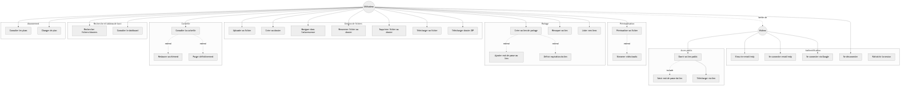

# Diagrammes UML

Les diagrammes sont disponibles en PNG dans `docs/diagrams/`. Les sources Mermaid (`.mmd`) sont versionnées dans le même dossier pour pouvoir régénérer les images en cas de modification (cf. [Régénérer les diagrammes](#régénérer-les-diagrammes)).

## Sommaire

1. [Diagramme de cas d'utilisation](#1-diagramme-de-cas-dutilisation)
2. [Diagramme de classes (modèle de données)](#2-diagramme-de-classes-modèle-de-données)
3. [Séquence : Login + Refresh JWT](#3-séquence--login--refresh-jwt)
4. [Séquence : OAuth Google (web)](#4-séquence--oauth-google-web)
5. [Séquence : OAuth Google (mobile)](#5-séquence--oauth-google-mobile)
6. [Séquence : Upload de fichier](#6-séquence--upload-de-fichier)
7. [Séquence : Création et utilisation d'un lien de partage](#7-séquence--création-et-utilisation-dun-lien-de-partage)
8. [Séquence : Téléchargement ZIP de dossier](#8-séquence--téléchargement-zip-de-dossier)
9. [Diagramme de déploiement](#9-diagramme-de-déploiement)

---

## 1. Diagramme de cas d'utilisation

Acteurs : **Visiteur** (non authentifié) et **Utilisateur** (authentifié, hérite des droits du visiteur).



Source : [diagrams/01-use-case.mmd](diagrams/01-use-case.mmd)

**Légende** :

- Trait plein : association acteur ⇄ cas d'utilisation
- `-.include.->` : le cas source inclut systématiquement le cas cible
- `-.extend.->` : le cas source peut être étendu par le cas cible (optionnel)

---

## 2. Diagramme de classes (modèle de données)


Source : [diagrams/02-class-diagram.mmd](diagrams/02-class-diagram.mmd)

**Contraintes** :

- `User.email` est unique.
- `OAuthAccount` : `(provider, providerId)` est unique.
- `ShareLink.token` est unique (génération aléatoire base64url 32 octets).
- `User.usedSpace` est plafonné à `Plan.quotaBytes` (FREE 5 Go / PRO 100 Go / BUSINESS 1 To).
- `deletedAt != null` ⟹ soft-delete (élément en corbeille).
- Cascade : `User` supprimé ⟹ toutes ses ressources cascadent. `Folder` ne peut pas être supprimé physiquement s'il contient des enfants (`onDelete: Restrict`).

---

## 3. Séquence : Login + Refresh JWT


Source : [diagrams/03-sequence-login.mmd](diagrams/03-sequence-login.mmd)

---

## 4. Séquence : OAuth Google (web)


Source : [diagrams/04-sequence-oauth-web.mmd](diagrams/04-sequence-oauth-web.mmd)

---

## 5. Séquence : OAuth Google (mobile)


Source : [diagrams/05-sequence-oauth-mobile.mmd](diagrams/05-sequence-oauth-mobile.mmd)

---

## 6. Séquence : Upload de fichier


Source : [diagrams/06-sequence-upload.mmd](diagrams/06-sequence-upload.mmd)

---

## 7. Séquence : Création et utilisation d'un lien de partage


Source : [diagrams/07-sequence-share.mmd](diagrams/07-sequence-share.mmd)

---

## 8. Séquence : Téléchargement ZIP de dossier

Le téléchargement ZIP utilise un token signé court (60s) pour pouvoir être utilisé dans un `<a download>` qui ne peut pas envoyer le header `Authorization`.


Source : [diagrams/08-sequence-zip.mmd](diagrams/08-sequence-zip.mmd)

---

## 9. Diagramme de déploiement


Source : [diagrams/09-deployment.mmd](diagrams/09-deployment.mmd)

**Détails du déploiement** :

| Conteneur          | Image                | Ports      | Volumes montés                             |
| ------------------ | -------------------- | ---------- | ------------------------------------------ |
| `supfile-web`      | image locale (nginx) | 80:80      | —                                          |
| `supfile-api`      | image locale (node)  | 3000:3000  | `supfile_storage:/data`                    |
| `supfile-postgres` | postgres:16-alpine   | non exposé | `supfile_pg_data:/var/lib/postgresql/data` |

**Communications** :

- Le **navigateur** charge le bundle SPA depuis `nginx`, puis appelle directement l'API NestJS sur `:3000` (CORS activé).
- L'**app mobile** appelle directement l'API NestJS (pas de passage par nginx).
- L'**API** communique avec Postgres sur le réseau Docker interne (le port Postgres n'est pas exposé à l'hôte en production).
- Les **fichiers uploadés** sont écrits sur le volume `supfile_storage`, persistant entre redémarrages des conteneurs.
- La **BDD** est sur le volume `supfile_pg_data`, persistant entre redémarrages.

**Healthchecks** :

- `supfile-postgres` : `pg_isready` toutes les 5s.
- `supfile-api` : `wget http://localhost:3000/api/v1/health` toutes les 5s.
- `supfile-api` attend `supfile-postgres` healthy avant de démarrer (`depends_on`).

---

## Régénérer les diagrammes

Les diagrammes PNG sont générés à partir des sources Mermaid dans `docs/diagrams/`. Pour les régénérer après modification d'un `.mmd` :

```bash
cd docs/diagrams
for f in *.mmd; do
  npx -y -p @mermaid-js/mermaid-cli mmdc -i "$f" -o "${f%.mmd}.png" -t neutral -b transparent -w 1600
done
```

Options :

- `-t neutral` : thème neutre (lisible en clair et sombre)
- `-b transparent` : fond transparent
- `-w 1600` : largeur 1600 px pour une haute résolution
