# Diagrammes UML

Les diagrammes sont fournis en PNG dans `docs/diagrams/` (et `docs/diagrams/use-cases/` pour les cas d'utilisation découpés par domaine).

## Sommaire

1. [Cas d'utilisation](#1-cas-dutilisation)
   - [1.0 Vue d'ensemble](#10-vue-densemble)
   - [1.1 Authentification](#11-authentification)
   - [1.2 Gestion de fichiers](#12-gestion-de-fichiers)
   - [1.3 Prévisualisation](#13-prévisualisation)
   - [1.4 Partage public](#14-partage-public)
   - [1.5 Partage interne](#15-partage-interne-entre-utilisateurs)
   - [1.6 Recherche & Dashboard](#16-recherche--dashboard)
   - [1.7 Corbeille](#17-corbeille)
   - [1.8 Abonnement & Profil](#18-abonnement--profil)
2. [Diagramme de classes (modèle de données)](#2-diagramme-de-classes-modèle-de-données)
3. [Séquence : Login + Refresh JWT](#3-séquence--login--refresh-jwt)
4. [Séquence : OAuth Google (web)](#4-séquence--oauth-google-web)
5. [Séquence : OAuth Google (mobile)](#5-séquence--oauth-google-mobile)
6. [Séquence : Upload de fichier](#6-séquence--upload-de-fichier)
7. [Séquence : Création et utilisation d'un lien de partage](#7-séquence--création-et-utilisation-dun-lien-de-partage)
8. [Séquence : Téléchargement ZIP de dossier](#8-séquence--téléchargement-zip-de-dossier)
9. [Diagramme de déploiement](#9-diagramme-de-déploiement)

---

## 1. Cas d'utilisation

Les cas d'utilisation sont scindés par domaine fonctionnel pour faciliter la lecture. Une vue d'ensemble présente les acteurs et leurs domaines respectifs, suivie d'un diagramme détaillé par domaine.

**Acteurs** :

- **Visiteur** : utilisateur non authentifié. Peut accéder à l'authentification et aux liens publics qui lui sont envoyés.
- **Utilisateur** : utilisateur authentifié. Hérite des droits du visiteur et accède à toutes les fonctionnalités de la plateforme.

**Légende des relations** :

- Trait plein : association acteur ⇄ cas d'utilisation
- `-.include.->` : le cas source inclut systématiquement le cas cible
- `-.extend.->` : le cas source peut être étendu par le cas cible (optionnel)

### 1.0 Vue d'ensemble

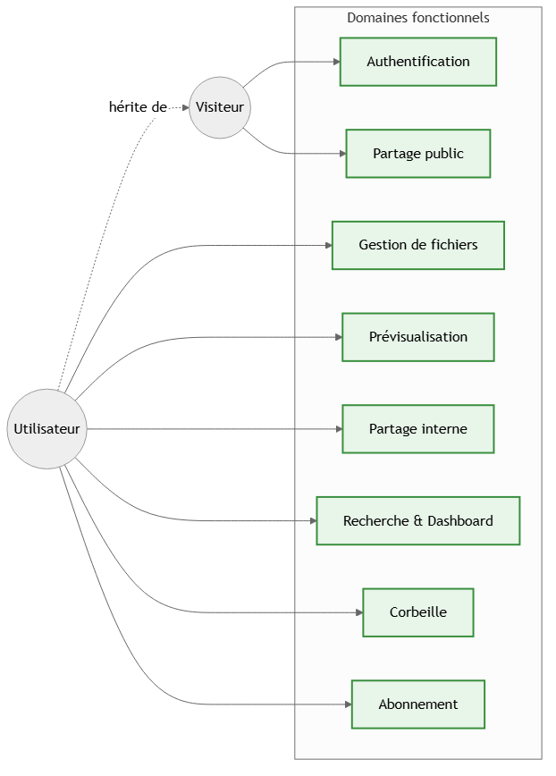

### 1.1 Authentification

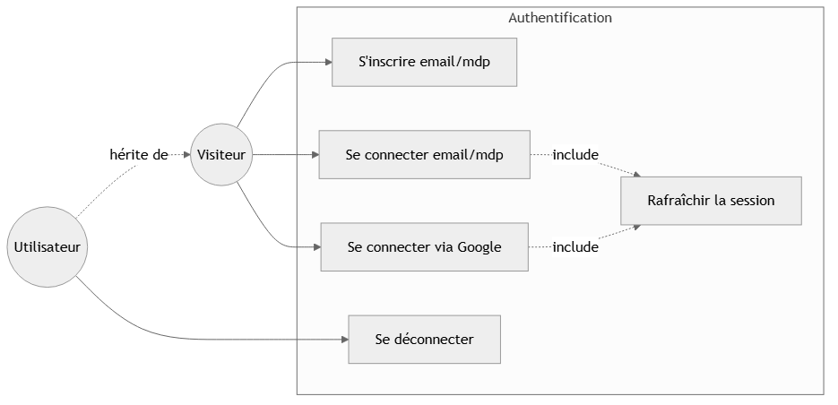

### 1.2 Gestion de fichiers

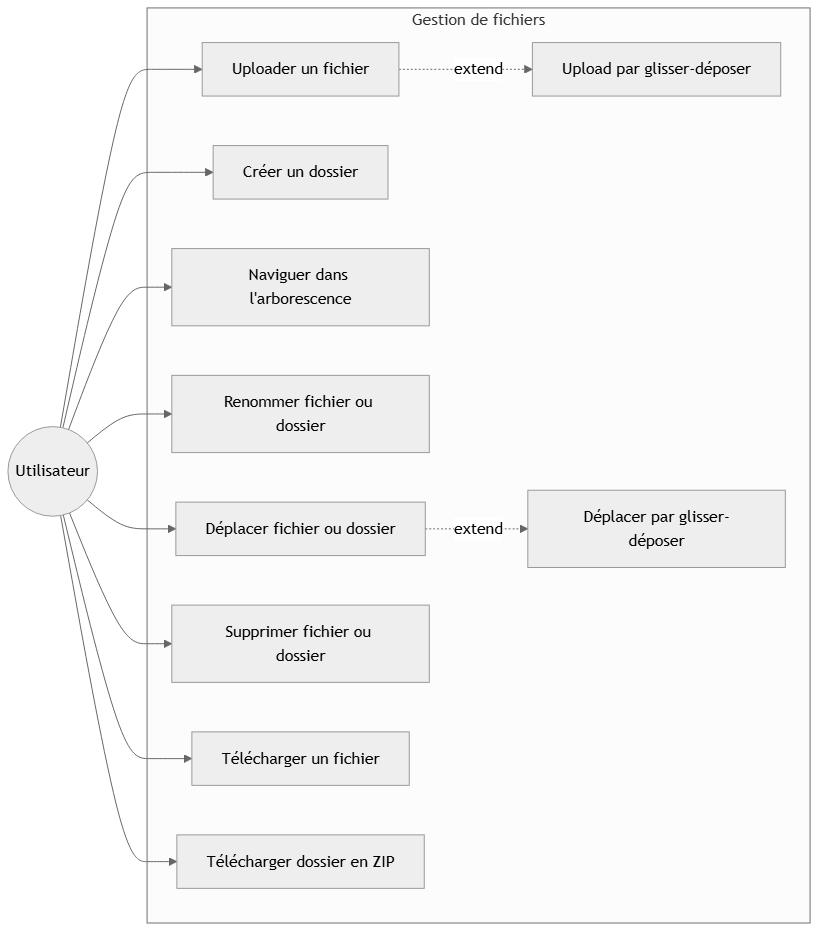

### 1.3 Prévisualisation

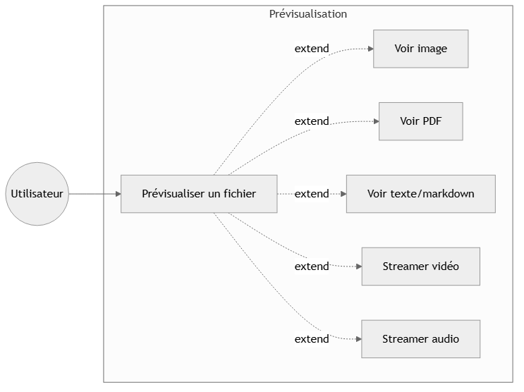

### 1.4 Partage public

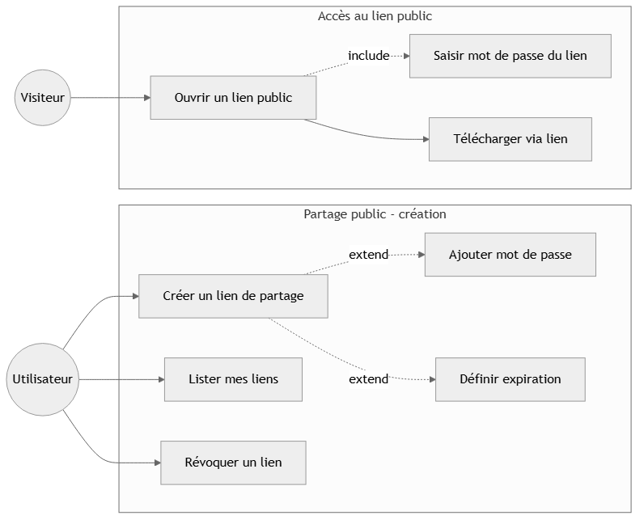

### 1.5 Partage interne entre utilisateurs

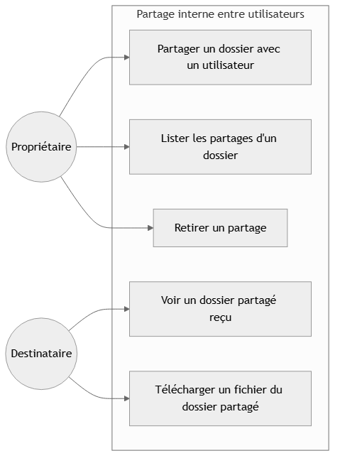

### 1.6 Recherche & Dashboard

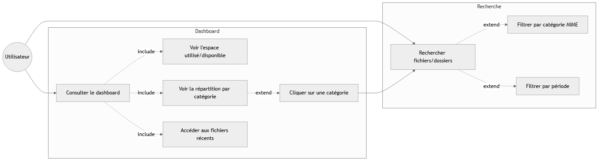

### 1.7 Corbeille

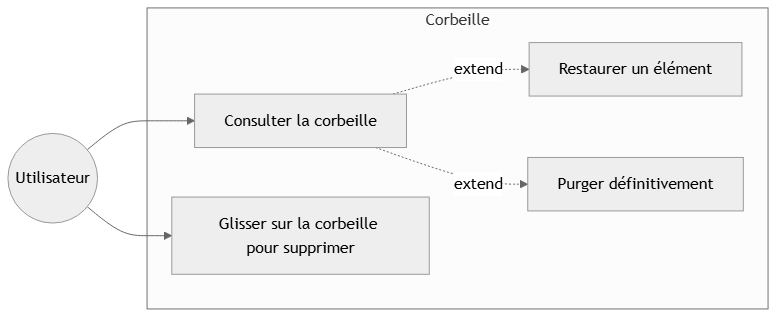

### 1.8 Abonnement & Profil

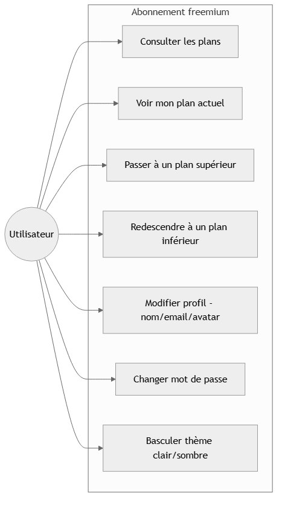

---

## 2. Diagramme de classes (modèle de données)

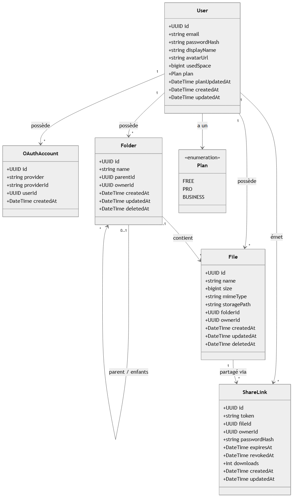

**Contraintes** :

- `User.email` est unique.
- `OAuthAccount` : `(provider, providerId)` est unique.
- `ShareLink.token` est unique (génération aléatoire base64url 32 octets).
- `User.usedSpace` est plafonné à `Plan.quotaBytes` (FREE 5 Go / PRO 100 Go / BUSINESS 1 To).
- `deletedAt != null` ⟹ soft-delete (élément en corbeille).
- Cascade : `User` supprimé ⟹ toutes ses ressources cascadent. `Folder` ne peut pas être supprimé physiquement s'il contient des enfants (`onDelete: Restrict`).

---

## 3. Séquence : Login + Refresh JWT

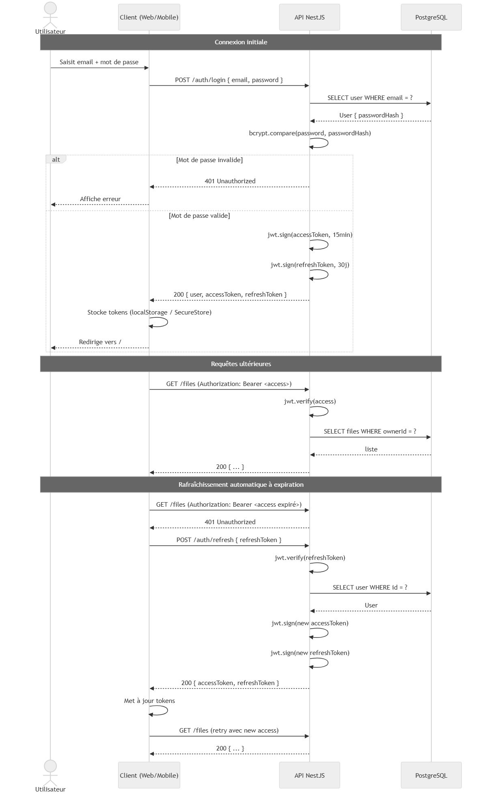

---

## 4. Séquence : OAuth Google (web)

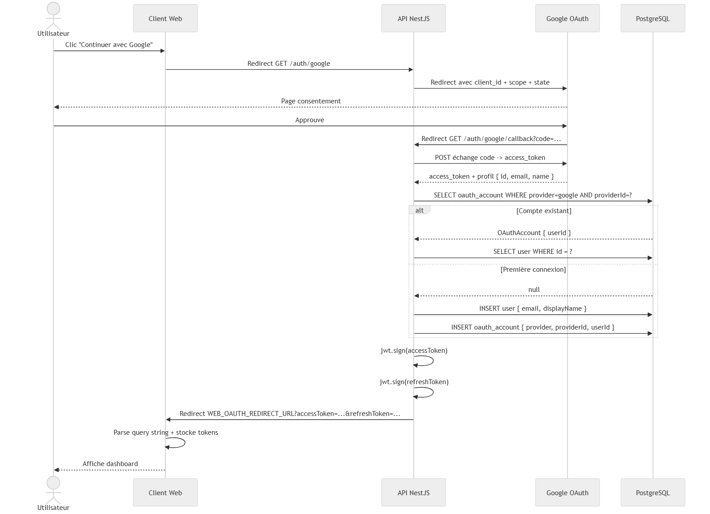

---

## 5. Séquence : OAuth Google (mobile)

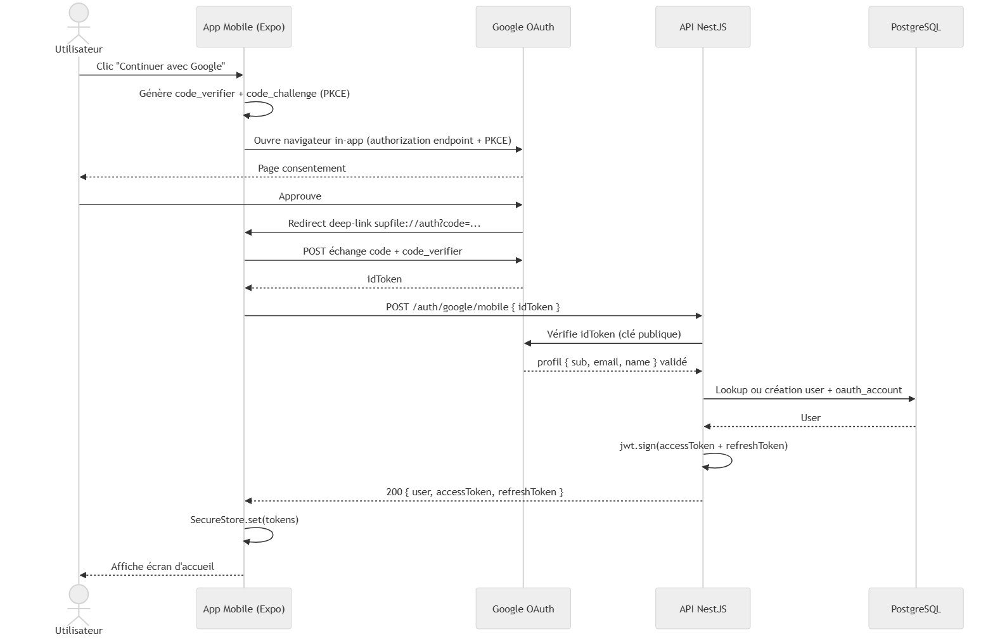

---

## 6. Séquence : Upload de fichier

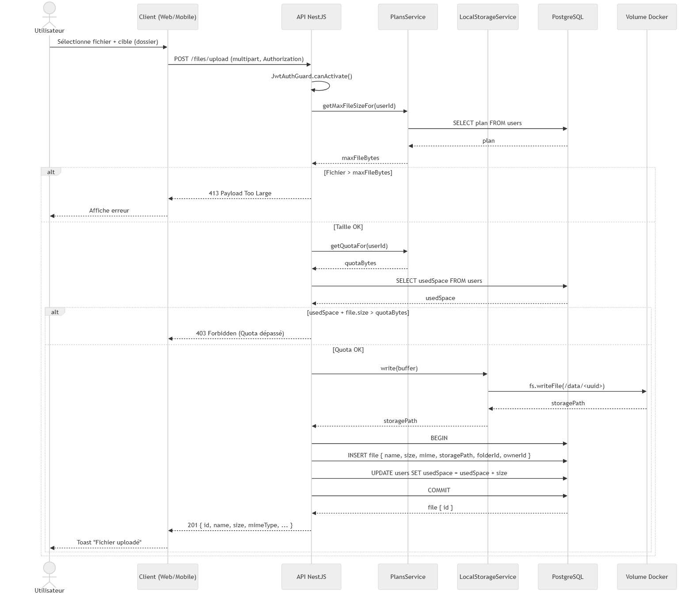

---

## 7. Séquence : Création et utilisation d'un lien de partage

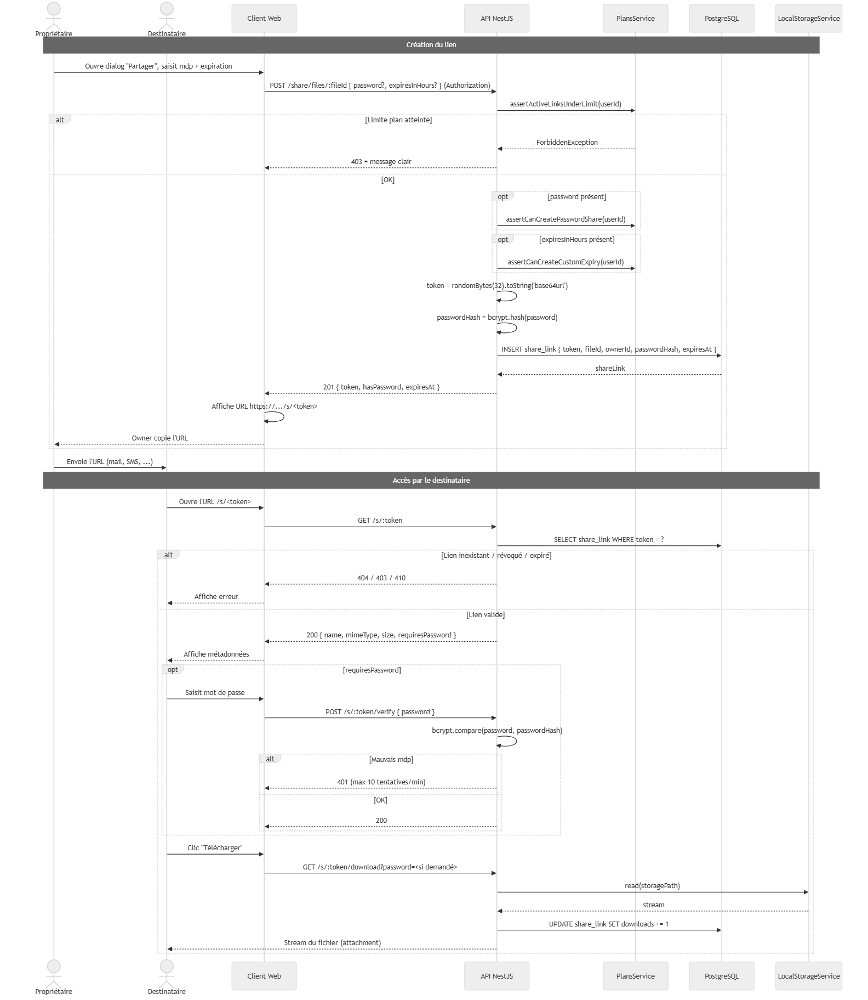

---

## 8. Séquence : Téléchargement ZIP de dossier

Le téléchargement ZIP utilise un token signé court (60s) pour pouvoir être utilisé dans un `<a download>` qui ne peut pas envoyer le header `Authorization`.

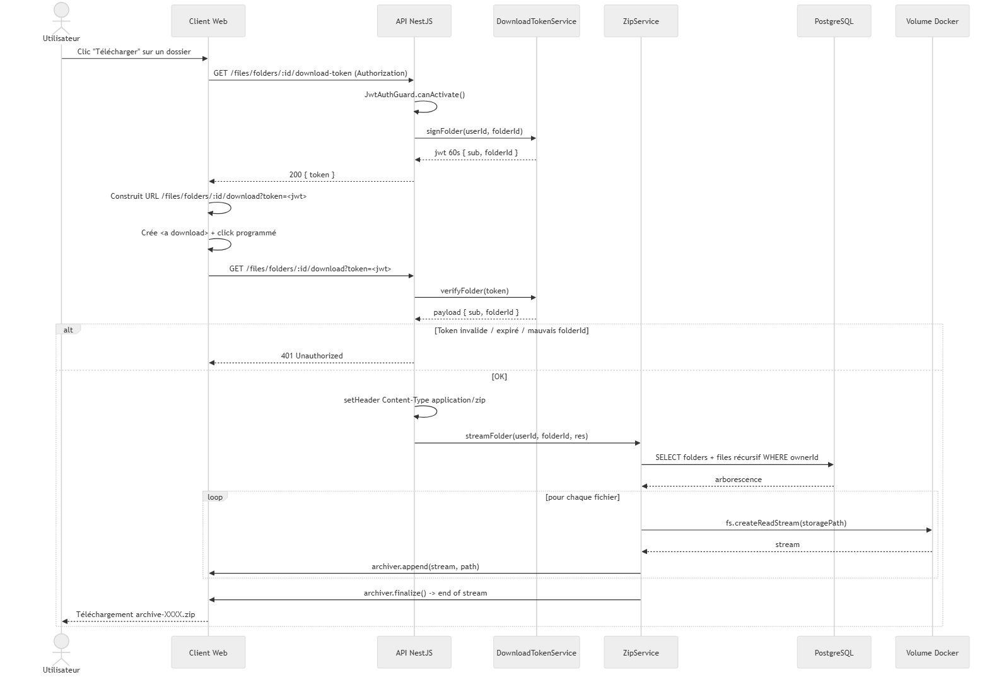

---

## 9. Diagramme de déploiement

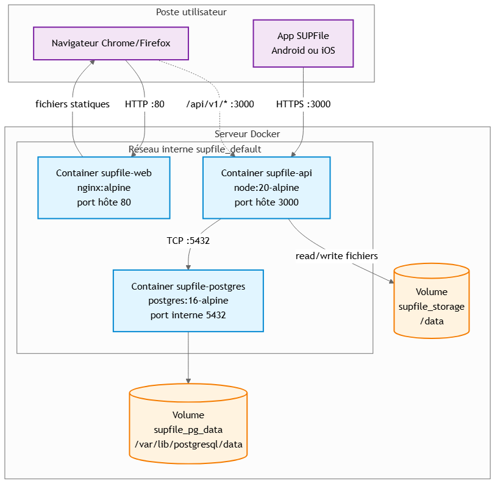

**Détails du déploiement** :

| Conteneur          | Image                | Ports      | Volumes montés                             |
| ------------------ | -------------------- | ---------- | ------------------------------------------ |
| `supfile-web`      | image locale (nginx) | 80:80      | —                                          |
| `supfile-api`      | image locale (node)  | 3000:3000  | `supfile_storage:/data`                    |
| `supfile-postgres` | postgres:16-alpine   | non exposé | `supfile_pg_data:/var/lib/postgresql/data` |

**Communications** :

- Le **navigateur** charge le bundle SPA depuis `nginx`, puis appelle directement l'API NestJS sur `:3000` (CORS activé).
- L'**app mobile** appelle directement l'API NestJS (pas de passage par nginx).
- L'**API** communique avec Postgres sur le réseau Docker interne (le port Postgres n'est pas exposé à l'hôte en production).
- Les **fichiers uploadés** sont écrits sur le volume `supfile_storage`, persistant entre redémarrages des conteneurs.
- La **BDD** est sur le volume `supfile_pg_data`, persistant entre redémarrages.

**Healthchecks** :

- `supfile-postgres` : `pg_isready` toutes les 5s.
- `supfile-api` : `wget http://localhost:3000/api/v1/health` toutes les 5s.
- `supfile-api` attend `supfile-postgres` healthy avant de démarrer (`depends_on`).
