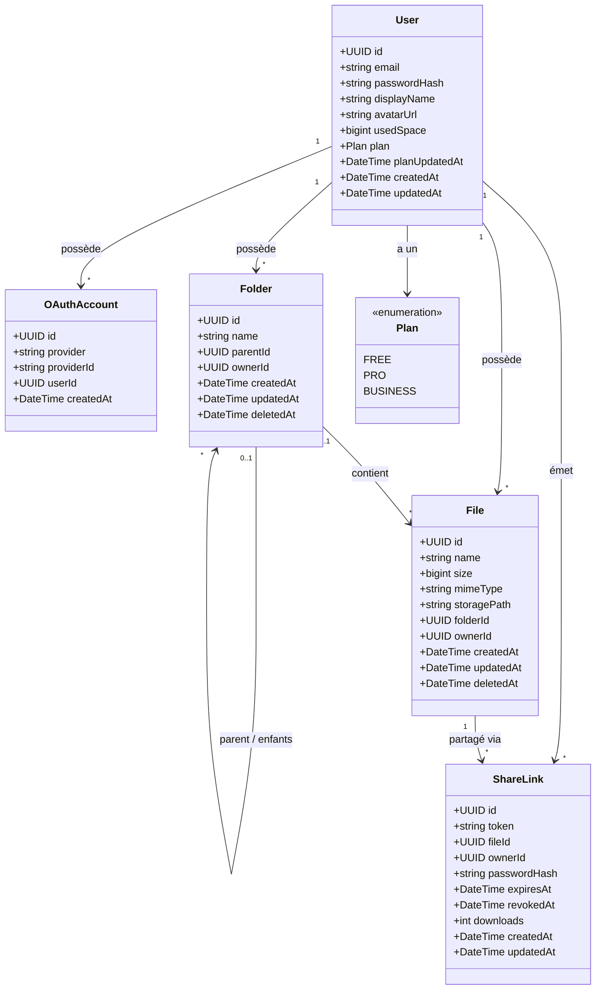
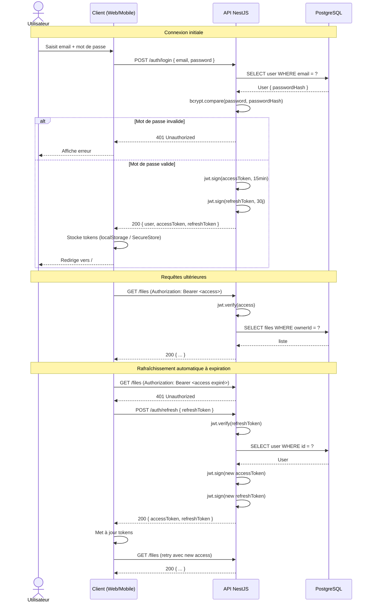
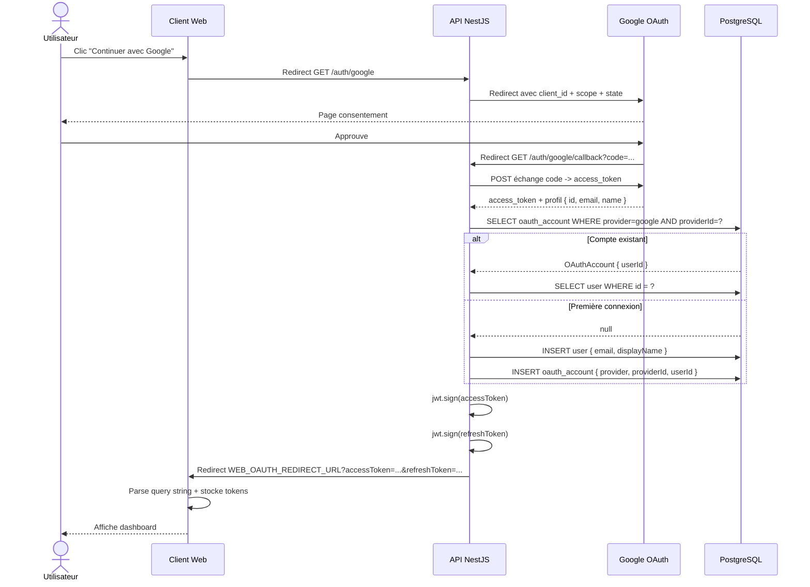
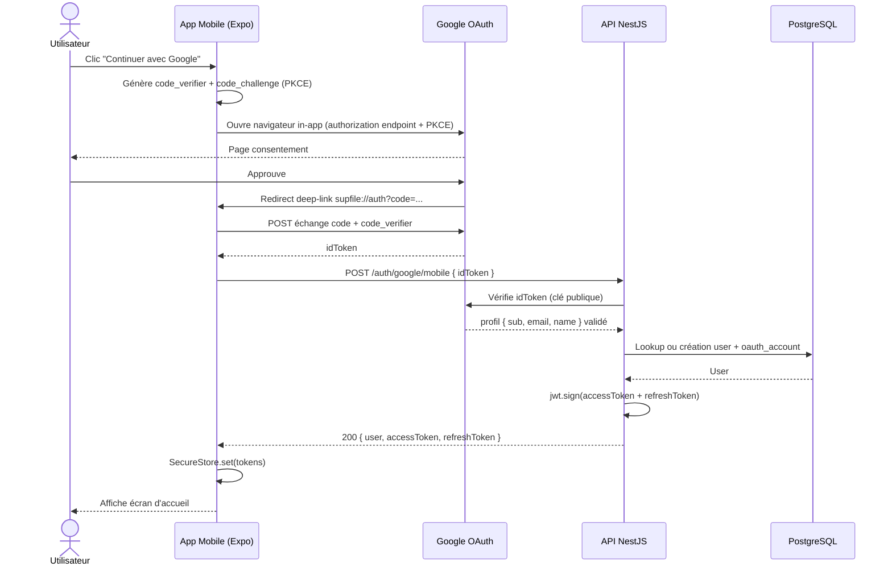
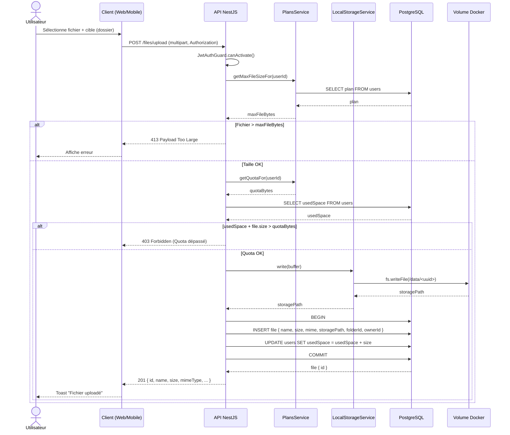
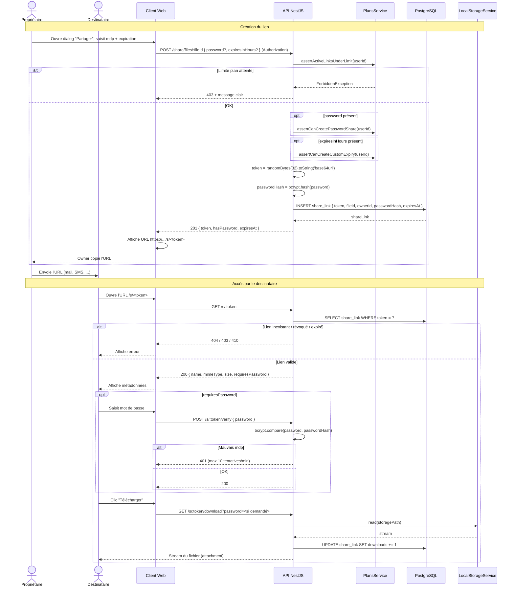
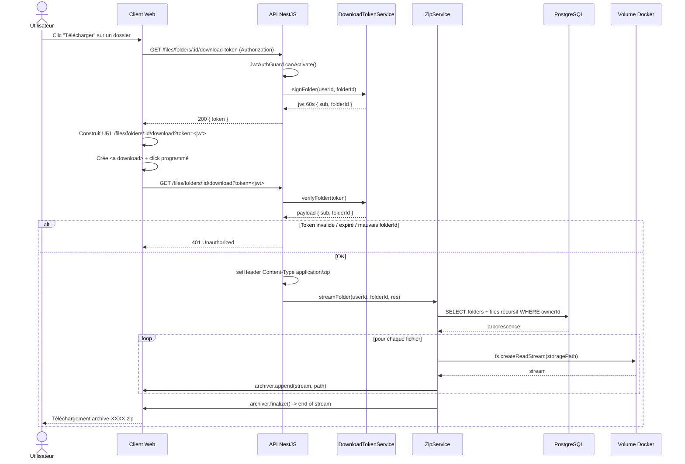
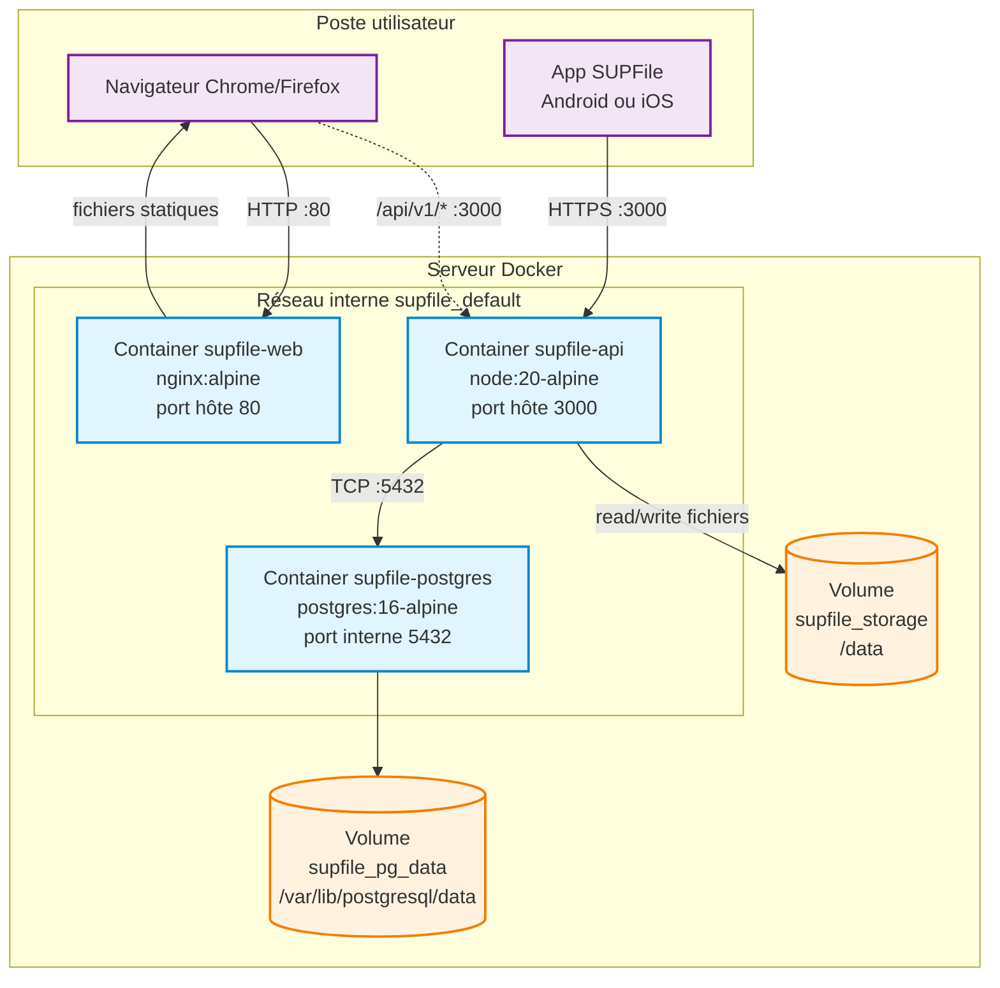

# Diagrammes UML

Tous les diagrammes sont en syntaxe **Mermaid**. Ils se rendent automatiquement sur GitHub, GitLab, VS Code (extension Markdown Preview Mermaid Support) et la plupart des éditeurs Markdown modernes.

## Sommaire

1. [Diagramme de cas d'utilisation](#1-diagramme-de-cas-dutilisation)
2. [Diagramme de classes (modèle de données)](#2-diagramme-de-classes-modèle-de-données)
3. [Diagramme de séquence : Login + Refresh JWT](#3-diagramme-de-séquence--login--refresh-jwt)
4. [Diagramme de séquence : OAuth Google (web)](#4-diagramme-de-séquence--oauth-google-web)
5. [Diagramme de séquence : OAuth Google (mobile)](#5-diagramme-de-séquence--oauth-google-mobile)
6. [Diagramme de séquence : Upload de fichier](#6-diagramme-de-séquence--upload-de-fichier)
7. [Diagramme de séquence : Création et utilisation d'un lien de partage](#7-diagramme-de-séquence--création-et-utilisation-dun-lien-de-partage)
8. [Diagramme de séquence : Téléchargement ZIP de dossier](#8-diagramme-de-séquence--téléchargement-zip-de-dossier)
9. [Diagramme de déploiement](#9-diagramme-de-déploiement)

---

## 1. Diagramme de cas d'utilisation

Acteurs : **Visiteur** (non authentifié) et **Utilisateur** (authentifié, hérite des droits du visiteur).

```mermaid
graph TB
    Visiteur((Visiteur))
    Utilisateur((Utilisateur))

    Utilisateur -.hérite de.-> Visiteur

    subgraph Authentification
        UC_Register[S'inscrire email/mdp]
        UC_LoginStd[Se connecter email/mdp]
        UC_LoginOAuth[Se connecter via Google]
        UC_Logout[Se déconnecter]
        UC_Refresh[Rafraîchir la session]
    end

    subgraph PartagePublic[Acces public]
        UC_OpenLink[Ouvrir un lien public]
        UC_VerifyPwd[Saisir mot de passe du lien]
        UC_DownloadPublic[Télécharger via lien]
    end

    subgraph GestionFichiers[Gestion de fichiers]
        UC_Upload[Uploader un fichier]
        UC_CreateFolder[Créer un dossier]
        UC_Navigate[Naviguer dans l'arborescence]
        UC_Rename[Renommer fichier ou dossier]
        UC_Delete[Supprimer fichier ou dossier]
        UC_Download[Télécharger un fichier]
        UC_DownloadZip[Télécharger dossier ZIP]
    end

    subgraph Previsualisation[Prévisualisation]
        UC_Preview[Prévisualiser un fichier]
        UC_StreamVideo[Streamer vidéo/audio]
    end

    subgraph Partage
        UC_CreateShare[Créer un lien de partage]
        UC_SharePwd[Ajouter mot de passe au lien]
        UC_ShareExp[Définir expiration du lien]
        UC_Revoke[Révoquer un lien]
        UC_ListShares[Lister mes liens]
    end

    subgraph Corbeille
        UC_ListTrash[Consulter la corbeille]
        UC_Restore[Restaurer un élément]
        UC_Purge[Purger définitivement]
    end

    subgraph Decouverte[Recherche et tableau de bord]
        UC_Search[Rechercher fichiers/dossiers]
        UC_Dashboard[Consulter le dashboard]
    end

    subgraph Abonnement
        UC_ViewPlans[Consulter les plans]
        UC_Upgrade[Changer de plan]
    end

    Visiteur --> UC_Register
    Visiteur --> UC_LoginStd
    Visiteur --> UC_LoginOAuth
    Visiteur --> UC_OpenLink
    UC_OpenLink -.include.-> UC_VerifyPwd
    UC_OpenLink --> UC_DownloadPublic

    Utilisateur --> UC_Logout
    Utilisateur --> UC_Upload
    Utilisateur --> UC_CreateFolder
    Utilisateur --> UC_Navigate
    Utilisateur --> UC_Rename
    Utilisateur --> UC_Delete
    Utilisateur --> UC_Download
    Utilisateur --> UC_DownloadZip
    Utilisateur --> UC_Preview
    UC_Preview -.extend.-> UC_StreamVideo
    Utilisateur --> UC_CreateShare
    UC_CreateShare -.extend.-> UC_SharePwd
    UC_CreateShare -.extend.-> UC_ShareExp
    Utilisateur --> UC_Revoke
    Utilisateur --> UC_ListShares
    Utilisateur --> UC_ListTrash
    UC_ListTrash -.extend.-> UC_Restore
    UC_ListTrash -.extend.-> UC_Purge
    Utilisateur --> UC_Search
    Utilisateur --> UC_Dashboard
    Utilisateur --> UC_ViewPlans
    Utilisateur --> UC_Upgrade
```

**Légende** :

- Trait plein : association acteur ⇄ cas d'utilisation
- `-.include.->` : le cas source inclut systématiquement le cas cible
- `-.extend.->` : le cas source peut être étendu par le cas cible (optionnel)

---

## 2. Diagramme de classes (modèle de données)

**Contraintes** :

- `User.email` est unique.
- `OAuthAccount` : `(provider, providerId)` est unique.
- `ShareLink.token` est unique (génération aléatoire base64url 32 octets).
- `User.usedSpace` est plafonné à `Plan.quotaBytes` (FREE 5 Go / PRO 100 Go / BUSINESS 1 To).
- `deletedAt != null` ⟹ soft-delete (élément en corbeille).
- Cascade : `User` supprimé ⟹ toutes ses ressources cascadent. `Folder` ne peut pas être supprimé physiquement s'il contient des enfants (`onDelete: Restrict`).

---

## 3. Diagramme de séquence : Login + Refresh JWT

---

## 4. Diagramme de séquence : OAuth Google (web)

---

## 5. Diagramme de séquence : OAuth Google (mobile)

---

## 6. Diagramme de séquence : Upload de fichier

---

## 7. Diagramme de séquence : Création et utilisation d'un lien de partage

---

## 8. Diagramme de séquence : Téléchargement ZIP de dossier

Le téléchargement ZIP utilise un token signé court (60s) pour pouvoir être utilisé dans un `<a download>` qui ne peut pas envoyer le header `Authorization`.

---

## 9. Diagramme de déploiement

**Détails du déploiement** :

| Conteneur          | Image                | Ports      | Volumes montés                             |
| ------------------ | -------------------- | ---------- | ------------------------------------------ |
| `supfile-web`      | image locale (nginx) | 80:80      | —                                          |
| `supfile-api`      | image locale (node)  | 3000:3000  | `supfile_storage:/data`                    |
| `supfile-postgres` | postgres:16-alpine   | non exposé | `supfile_pg_data:/var/lib/postgresql/data` |

**Communications** :

- Le **navigateur** charge le bundle SPA depuis `nginx`, puis appelle directement l'API NestJS sur `:3000` (CORS activé).
- L'**app mobile** appelle directement l'API NestJS (pas de passage par nginx).
- L'**API** communique avec Postgres sur le réseau Docker interne (le port Postgres n'est pas exposé à l'hôte en production).
- Les **fichiers uploadés** sont écrits sur le volume `supfile_storage`, persistant entre redémarrages des conteneurs.
- La **BDD** est sur le volume `supfile_pg_data`, persistant entre redémarrages.

**Healthchecks** :

- `supfile-postgres` : `pg_isready` toutes les 5s.
- `supfile-api` : `wget http://localhost:3000/api/v1/health` toutes les 5s.
- `supfile-api` attend `supfile-postgres` healthy avant de démarrer (`depends_on`).
