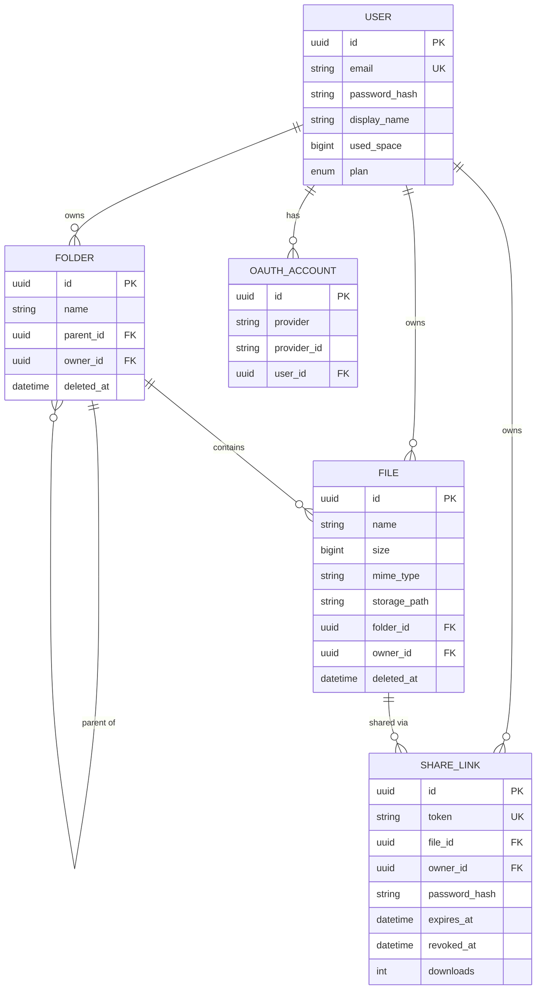

# Documentation technique — SUPFile

Projet 4PROJ SUPINFO. Plateforme de stockage cloud type Drive/Dropbox, déclinée en web et mobile.

## Sommaire

1. [Pré-requis et installation](#1-pré-requis-et-installation)
2. [Guide de déploiement](#2-guide-de-déploiement)
3. [Choix technologiques](#3-choix-technologiques)
4. [Architecture générale](#4-architecture-générale)
5. [Modèle de données](#5-modèle-de-données)
6. [Diagramme de cas d'utilisation](#6-diagramme-de-cas-dutilisation)
7. [Endpoints API](#7-endpoints-api)
8. [Sécurité](#8-sécurité)

---

## 1. Pré-requis et installation

### Pré-requis

| Outil          | Version minimale | Usage                |
| -------------- | ---------------- | -------------------- |
| Docker Desktop | 24+              | Déploiement          |
| Docker Compose | v2               | Orchestration        |
| Node.js        | 20 LTS           | Dev local uniquement |
| pnpm           | 9+               | Dev local uniquement |

### Installation pour déploiement

Le déploiement de référence se fait via Docker. Aucun pré-requis Node n'est nécessaire sur la machine hôte.

```bash
git clone https://github.com/zenderw/supfile.git
cd supfile
cp .env.example .env
# Éditer .env pour fixer POSTGRES_PASSWORD, JWT_SECRET, JWT_REFRESH_SECRET
docker compose up -d --build
```

Le premier build prend 3 à 5 minutes (build de l'image API NestJS + build du front Vite + récupération de Postgres et Nginx).

### Installation pour développement

```bash
pnpm install
cp .env.example .env
docker compose -f docker-compose.dev.yml up -d   # uniquement postgres + adminer
pnpm --filter @supfile/api dev                    # API sur :3000
pnpm --filter @supfile/web dev                    # Web sur :5173
pnpm --filter @supfile/mobile start               # Mobile (QR Code Expo Go)
```

---

## 2. Guide de déploiement

### Variables d'environnement obligatoires

Les variables suivantes doivent obligatoirement être positionnées avant le premier `docker compose up` :

| Variable               | Description                | Exemple                                                   |
| ---------------------- | -------------------------- | --------------------------------------------------------- |
| `POSTGRES_PASSWORD`    | Mot de passe de la base    | chaîne aléatoire 24 caractères                            |
| `JWT_SECRET`           | Secret JWT access tokens   | chaîne aléatoire 64+ caractères                           |
| `JWT_REFRESH_SECRET`   | Secret JWT refresh tokens  | chaîne aléatoire 64+ caractères distincte de `JWT_SECRET` |
| `GOOGLE_CLIENT_ID`     | Client ID OAuth Google     | obtenu sur Google Cloud Console                           |
| `GOOGLE_CLIENT_SECRET` | Client Secret OAuth Google | idem                                                      |

Une commande pour générer un secret JWT aléatoire :

```bash
openssl rand -hex 32
```

Le fichier `.env.example` à la racine sert de modèle.

### Architecture des conteneurs

`docker compose up` démarre trois services en réseau interne :

| Service            | Image                | Port hôte  | Volume            |
| ------------------ | -------------------- | ---------- | ----------------- |
| `supfile-postgres` | postgres:16-alpine   | non exposé | `supfile_pg_data` |
| `supfile-api`      | image locale         | 3000       | `supfile_storage` |
| `supfile-web`      | image locale (nginx) | 80         | —                 |

Les volumes Docker `supfile_pg_data` et `supfile_storage` assurent la persistance entre redémarrages. `docker compose down` préserve les données ; `docker compose down -v` supprime les volumes et donc les données.

### Migrations base de données

L'API applique automatiquement les migrations Prisma au démarrage via le script de l'entrypoint. Aucune action manuelle n'est nécessaire.

### Healthchecks

- `GET http://localhost:3000/api/v1/health` retourne `{ status: 'ok', database: 'up' }` quand l'API est prête.
- Le service `postgres` du compose a un healthcheck `pg_isready` interne ; l'API attend que Postgres soit healthy avant de démarrer.

### Mise à jour

```bash
git pull
docker compose up -d --build
```

Les images sont rebuild avec layering Docker, donc seules les couches modifiées sont reconstruites.

---

## 3. Choix technologiques

### Backend : NestJS + Prisma + PostgreSQL

- **NestJS** apporte une architecture modulaire en TypeScript (modules / contrôleurs / services / guards), pratique pour scinder le code par domaine (auth, files, folders, share, etc.). Le système d'injection de dépendances facilite les tests et le découplage.
- **Prisma** comme ORM permet un schéma fortement typé partagé entre runtime et compilation, et génère un client typesafe. Les migrations sont versionnées et appliquées automatiquement au déploiement.
- **PostgreSQL** pour les métadonnées : les contraintes relationnelles (clés étrangères avec cascade) garantissent la cohérence référentielle entre users, dossiers, fichiers et liens de partage.

### Frontend web : React + Vite + shadcn/ui

- **React 18** + **Vite** pour le bundler (build rapide, HMR en dev).
- **shadcn/ui** + **Tailwind CSS** pour les composants : pas de runtime CSS-in-JS, composants accessibles, design system cohérent.
- **TanStack Query** pour la gestion d'état serveur : cache, invalidation, refetch automatique. Évite de réinventer la logique de synchronisation.
- **Zustand** pour l'état client léger (auth store).

### Mobile : Expo (React Native)

- **Expo SDK 54** pour un setup mobile sans toucher à Xcode/Android Studio. Build Android et iOS depuis le même code.
- **Expo Router** pour la navigation file-based.
- **NativeWind** pour réutiliser Tailwind sur React Native.
- **expo-image-picker / expo-document-picker / expo-camera** pour les uploads natifs.

### Stockage des fichiers

Conformément à la consigne, les fichiers ne sont pas stockés en base. Le service `LocalStorageService` les écrit sur un volume Docker (`supfile_storage`), monté sur `/data` dans le conteneur API. Le path interne est opaque (UUID + suffixe), seul l'API connaît la correspondance fichier ⇆ path.

L'interface `StorageService` est abstraite (`apps/api/src/storage/storage.interface.ts`), ce qui permet de brancher plus tard un backend S3 ou MinIO sans toucher au reste du code.

### Authentification

- **JWT** : token d'accès court (15 minutes) + refresh token long (30 jours). Les secrets sont distincts pour éviter les attaques de re-signature.
- **bcrypt** pour le hash des mots de passe (10 rounds).
- **OAuth2 Google** via Passport.js (`passport-google-oauth20`). La création de compte est automatique à la première connexion ; un compte local et un compte OAuth peuvent cohabiter via la table `OAuthAccount`.

### Containerisation

- Images **multi-stage** pour minimiser la taille finale (couche build + couche runtime alpine).
- L'image web est servie par **nginx** avec un rewrite SPA (`try_files $uri /index.html`) et un reverse proxy vers l'API absent (pas nécessaire en monolithe).
- Volumes nommés Docker pour la persistance (BDD + fichiers stockés).

---

## 4. Architecture générale

```
┌─────────────────┐       ┌─────────────────┐
│   Web client    │       │ Mobile client   │
│ React + Vite    │       │ Expo / RN       │
│ nginx (port 80) │       │                 │
└────────┬────────┘       └────────┬────────┘
         │                         │
         │     HTTPS / JSON        │
         └──────────┬──────────────┘
                    │
                    ▼
         ┌──────────────────────┐
         │   API NestJS         │
         │   port 3000          │
         │ ┌──────────────────┐ │
         │ │ auth / files /   │ │
         │ │ folders / share/ │ │
         │ │ search / stats / │ │
         │ │ trash / plans    │ │
         │ └──────────────────┘ │
         └────────┬─────────────┘
                  │
        ┌─────────┴─────────┐
        ▼                   ▼
┌──────────────┐   ┌────────────────┐
│ PostgreSQL   │   │ Volume Docker  │
│ métadonnées  │   │ fichiers bruts │
│ (users,      │   │ /data/...      │
│  files,      │   │                │
│  folders,    │   │                │
│  shares)     │   │                │
└──────────────┘   └────────────────┘
```

**Principe** : aucune logique métier sur les clients. L'authentification, les permissions, la gestion du quota et les opérations sur fichiers sont entièrement gérées par l'API. Les clients ne font que afficher l'état et envoyer les actions utilisateur.

### Découpage en modules NestJS

| Module          | Responsabilité                                                                                                     |
| --------------- | ------------------------------------------------------------------------------------------------------------------ |
| `AuthModule`    | Inscription, connexion email/mdp, OAuth Google, JWT access + refresh                                               |
| `FilesModule`   | Upload, métadonnées, rename, soft-delete, download (avec range requests pour streaming), génération ZIP de dossier |
| `FoldersModule` | Arborescence, breadcrumb, CRUD dossiers                                                                            |
| `ShareModule`   | Liens publics avec mot de passe et expiration, révocation, accès public via token                                  |
| `SearchModule`  | Recherche fichiers et dossiers par nom                                                                             |
| `StatsModule`   | Dashboard : quota utilisé, fichiers récents, répartition par type                                                  |
| `TrashModule`   | Corbeille : listing, restauration, purge définitive                                                                |
| `PlansModule`   | Business model freemium (FREE / PRO / BUSINESS) avec quotas et features différenciés                               |
| `StorageModule` | Abstraction du stockage physique (implémentation locale sur volume Docker)                                         |
| `PrismaModule`  | Client Prisma partagé                                                                                              |
| `HealthModule`  | `GET /health` pour Docker healthcheck                                                                              |

### Flux d'authentification (login standard)

```
1. POST /auth/login { email, password }
2. API verifie password (bcrypt.compare)
3. API signe accessToken (15 min) + refreshToken (30 j)
4. Client stocke les tokens (localStorage sur web, SecureStore sur mobile)
5. Chaque requête : header Authorization: Bearer <accessToken>
6. À l'expiration (401), client appelle POST /auth/refresh { refreshToken }
   et re-tente la requête originale (interceptor axios)
```

### Flux OAuth2 Google

```
Web :
1. Clic "Continuer avec Google" → redirection /auth/google
2. NestJS via Passport ouvre la fenêtre Google
3. Callback /auth/google/callback : NestJS récupère le profil,
   crée le compte si nouveau, génère les JWT
4. Redirection vers WEB_OAUTH_REDIRECT_URL avec tokens en query string
5. Le client lit les tokens et les stocke

Mobile :
1. Expo Auth Session (PKCE) → token Google ID
2. Client envoie POST /auth/google/mobile { idToken }
3. NestJS vérifie le token avec Google, applique la même logique
```

---

## 5. Modèle de données

### Schéma relationnel

```
┌──────────────────────────────┐
│  users                       │
│  ────                        │
│  id (uuid, PK)               │
│  email (unique)              │
│  password_hash               │
│  display_name                │
│  avatar_url                  │
│  used_space (bigint)         │
│  plan (enum FREE/PRO/BUSI.)  │
│  plan_updated_at             │
│  created_at, updated_at      │
└──┬───────────────┬─────────┬─┘
   │1              │1        │1
   │               │         │
   │N              │N        │N
┌──▼──────────┐┌───▼─────┐┌──▼──────────┐
│ folders     ││ files   ││ oauth_accts │
│ ────        ││ ────    ││ ────        │
│ id          ││ id      ││ id          │
│ name        ││ name    ││ provider    │
│ parent_id ──┼┤ size    ││ provider_id │
│ owner_id    ││ mime    ││ user_id (FK)│
│ deleted_at  ││ path    │└─────────────┘
│             ││ folder_id (FK opt.)
└─────┬───────┘│ owner_id
      │1       │ deleted_at
      │        └────┬────────┘
      │             │1
      │N            │N
      └─────────────┤
                    │
              ┌─────▼─────────────┐
              │ share_links       │
              │ ────              │
              │ id                │
              │ token (unique)    │
              │ file_id (FK)      │
              │ owner_id (FK)     │
              │ password_hash opt.│
              │ expires_at opt.   │
              │ revoked_at opt.   │
              │ downloads (int)   │
              └───────────────────┘
```

### Diagramme en Mermaid



### Notes sur le modèle

- **Soft delete** : `deleted_at` est positionné à la place d'un `DELETE` physique. La purge définitive est explicite depuis la corbeille.
- **Quota** : maintenu sur `users.used_space` (bigint pour gérer plusieurs To), mis à jour en transaction à chaque upload / purge.
- **Storage path opaque** : la valeur de `files.storage_path` est générée par `LocalStorageService.write()` et n'est jamais exposée au client.
- **Cascade** : la suppression d'un utilisateur cascade sur tous ses fichiers, dossiers, liens et comptes OAuth. La suppression d'un dossier non vide est bloquée (`onDelete: Restrict`) pour préserver la cohérence.

---

## 6. Diagramme de cas d'utilisation

```mermaid
flowchart TB
    subgraph Acteurs
        VU[Visiteur non connecte]
        U[Utilisateur connecte]
    end

    subgraph CasDUsage
        UC1[S inscrire email/mot de passe]
        UC2[S inscrire via Google]
        UC3[Se connecter]
        UC4[Telecharger un lien public]
        UC5[Uploader un fichier]
        UC6[Creer/renommer/supprimer dossier]
        UC7[Previsualiser un fichier]
        UC8[Telecharger un fichier]
        UC9[Telecharger un dossier ZIP]
        UC10[Generer un lien de partage]
        UC11[Definir mot de passe et expiration sur lien]
        UC12[Revoquer un lien]
        UC13[Rechercher fichiers/dossiers]
        UC14[Consulter le dashboard]
        UC15[Gerer la corbeille]
        UC16[Upgrader son plan]
    end

    VU --> UC1
    VU --> UC2
    VU --> UC3
    VU --> UC4

    U --> UC5
    U --> UC6
    U --> UC7
    U --> UC8
    U --> UC9
    U --> UC10
    U --> UC11
    U --> UC12
    U --> UC13
    U --> UC14
    U --> UC15
    U --> UC16
```



---

## 7. Endpoints API

Toutes les routes API sont préfixées par `/api/v1`. Les routes marquées 🔒 nécessitent un header `Authorization: Bearer <accessToken>`.

### Auth

| Méthode | Route                   | Description                                         |
| ------- | ----------------------- | --------------------------------------------------- |
| POST    | `/auth/register`        | Inscription email/mot de passe                      |
| POST    | `/auth/login`           | Connexion email/mot de passe                        |
| POST    | `/auth/refresh`         | Échange refresh token contre nouveau access token   |
| GET     | `/auth/me` 🔒           | Profil de l'utilisateur courant                     |
| GET     | `/auth/google`          | Démarre le flow OAuth Google (web)                  |
| GET     | `/auth/google/callback` | Callback Google, redirige vers le front avec tokens |
| POST    | `/auth/google/mobile`   | Connexion Google depuis mobile (idToken PKCE)       |

### Folders

| Méthode | Route                        | Description                  |
| ------- | ---------------------------- | ---------------------------- | ------------------------------------------- |
| GET     | `/folders?parentId=<uuid     | null>` 🔒                    | Liste fichiers + sous-dossiers d'un dossier |
| GET     | `/folders/:id/breadcrumb` 🔒 | Fil d'Ariane d'un dossier    |
| POST    | `/folders` 🔒                | Créer un dossier             |
| PATCH   | `/folders/:id` 🔒            | Renommer un dossier          |
| DELETE  | `/folders/:id` 🔒            | Soft-delete (vers corbeille) |

### Files

| Méthode | Route                            | Description                                                                               |
| ------- | -------------------------------- | ----------------------------------------------------------------------------------------- |
| POST    | `/files/upload` 🔒               | Upload (multipart, champ `file`)                                                          |
| GET     | `/files/:id` 🔒                  | Métadonnées                                                                               |
| PATCH   | `/files/:id` 🔒                  | Renommer                                                                                  |
| DELETE  | `/files/:id` 🔒                  | Soft-delete                                                                               |
| GET     | `/files/:id/download-token` 🔒   | Génère un token signé court (pour passer en query string sur balises `<video>` / ``) |
| GET     | `/files/:id/download?token=...`  | Téléchargement / streaming (range requests supportées)                                    |
| GET     | `/files/folders/:id/download` 🔒 | Téléchargement ZIP à la volée d'un dossier complet                                        |

### Share

| Méthode | Route                             | Description                                                   |
| ------- | --------------------------------- | ------------------------------------------------------------- |
| POST    | `/share/files/:fileId` 🔒         | Créer un lien de partage (options : mot de passe, expiration) |
| GET     | `/share/mine` 🔒                  | Liste de mes liens actifs                                     |
| DELETE  | `/share/:id` 🔒                   | Révoquer un lien                                              |
| GET     | `/s/:token`                       | Métadonnées publiques d'un lien                               |
| POST    | `/s/:token/verify`                | Vérifier le mot de passe d'un lien (10 req/min max)           |
| GET     | `/s/:token/download?password=...` | Télécharger via lien public                                   |

### Search

| Méthode | Route                                       | Description                                                    |
| ------- | ------------------------------------------- | -------------------------------------------------------------- |
| GET     | `/search?q=...&type=...&from=...&to=...` 🔒 | Recherche unifiée fichiers + dossiers, avec filtres optionnels |

### Stats

| Méthode | Route       | Description                                                                |
| ------- | ----------- | -------------------------------------------------------------------------- |
| GET     | `/stats` 🔒 | Quota utilisé, total fichiers, fichiers récents, répartition par type MIME |

### Trash

| Méthode | Route                           | Description                     |
| ------- | ------------------------------- | ------------------------------- |
| GET     | `/trash` 🔒                     | Liste des éléments en corbeille |
| POST    | `/trash/folders/:id/restore` 🔒 | Restaurer un dossier            |
| POST    | `/trash/files/:id/restore` 🔒   | Restaurer un fichier            |
| DELETE  | `/trash/folders/:id` 🔒         | Purge définitive d'un dossier   |
| DELETE  | `/trash/files/:id` 🔒           | Purge définitive d'un fichier   |

### Plans (business model freemium)

| Méthode | Route                  | Description                                         |
| ------- | ---------------------- | --------------------------------------------------- |
| GET     | `/plans`               | Liste des plans disponibles avec features et tarifs |
| GET     | `/plans/me` 🔒         | Plan courant + features de l'utilisateur            |
| POST    | `/plans/me/upgrade` 🔒 | Changer de plan (FREE / PRO / BUSINESS)             |

### Health

| Méthode | Route     | Description                                |
| ------- | --------- | ------------------------------------------ |
| GET     | `/health` | Statut API + BDD (pour healthcheck Docker) |

---

## 8. Sécurité

### Authentification

- Mots de passe hashés via **bcrypt** (10 rounds, salt unique par mot de passe).
- **JWT** : algorithme HS256, secrets distincts pour access et refresh.
- Access token court (15 min) + refresh token long (30 j) avec rotation possible.
- Logout = suppression côté client. Pas de session serveur. Possibilité d'invalider un refresh token en cas de besoin (à implémenter via blacklist si nécessaire).

### Scoping par utilisateur

Toutes les requêtes authentifiées extraient le `userId` du JWT décodé (via `CurrentUser` decorator). Les requêtes Prisma filtrent systématiquement par `ownerId`, ce qui empêche un utilisateur d'accéder aux ressources d'un autre, même en forgeant l'UUID.

Exemple (extrait de `FilesService.softDelete`) :

```typescript
const file = await this.prisma.file.findFirst({
  where: { id: fileId, ownerId: userId, deletedAt: null },
});
if (!file) throw new NotFoundException('Fichier introuvable');
```

L'erreur retournée est volontairement « introuvable » et non « interdit » pour ne pas révéler l'existence d'une ressource appartenant à un autre user (enumeration attack).

### Rate limiting

`@nestjs/throttler` est appliqué globalement (100 req/min/IP) et plus strictement sur les endpoints sensibles :

- `/auth/login` et `/auth/register` : 5 tentatives/min/IP
- `/s/:token/verify` : 10 tentatives/min/IP

### Validation des entrées

- Tous les corps de requête sont validés via **class-validator** (DTO décorés).
- Les UUIDs en paramètre passent par `ParseUUIDPipe({ version: '4' })`.
- Les noms de fichiers sont sanitisés à l'upload (suppression `..`, slashes, caractères de contrôle).
- Multer rejette les fichiers > 5 Go et certaines extensions (`.exe`, `.bat`, `.sh`, etc.).

### Headers HTTP

`helmet` est activé en production :

- `X-Content-Type-Options: nosniff`
- `Strict-Transport-Security` (si HTTPS)
- `Referrer-Policy: no-referrer`
- `X-Frame-Options: désactivé` (pour autoriser l'iframe PDF interne)

CORS configuré pour autoriser uniquement l'origine du front.

### Secrets

- **Aucun secret en clair dans le code.** Tous les secrets passent par variables d'environnement.
- Le fichier `.env` est dans `.gitignore`. Seul `.env.example` (avec placeholders) est versionné.
- Les images Docker sont buildées en multi-stage, les secrets ne sont jamais copiés dans le runtime.

### Liens de partage

- Token de **32 octets aléatoires** encodés en base64url (≈ 256 bits d'entropie).
- Mot de passe optionnel hashé bcrypt indépendamment du mot de passe utilisateur.
- Expiration optionnelle, vérifiée à chaque accès.
- Révocation immédiate possible : un lien révoqué renvoie 403 même si pas expiré.
- Compteur `downloads` incrémenté à chaque téléchargement réussi pour traçabilité.

### Téléchargements via token signé

Le téléchargement de fichiers privés (`/files/:id/download`) utilise un **token JWT court** signé spécifiquement pour le téléchargement (15 minutes). Cela permet :

- D'utiliser des balises `<video>` / `` qui n'envoient pas le header `Authorization`.
- D'éviter de mettre le JWT access global dans la query string.
- D'invalider rapidement un lien temporaire de prévisualisation.

---

## Annexes

### Limites connues

Cette version livrée pour la soutenance ne comprend pas :

- **Partage de dossier entre utilisateurs internes** : seul le partage de fichier via lien public est implémenté. Le partage interne fait partie du barème (20 pts) mais n'a pas été développé faute de temps.
- **Drag & drop** sur la zone d'upload web (upload se fait via le bouton « Envoyer un fichier »).
- **OAuth** : seul Google est implémenté. GitHub et Microsoft sont structurellement supportés (table `oauth_accounts` polymorphe) mais leurs strategies Passport ne sont pas enregistrées.

### Repère du dépôt Git

Le dépôt sera rendu privé jusqu'à la soutenance puis ouvert : https://github.com/zenderw/supfile

L'historique de commits suit la convention [Conventional Commits](https://www.conventionalcommits.org/) en français (`feat:`, `fix:`, `chore:`, `docs:`).
